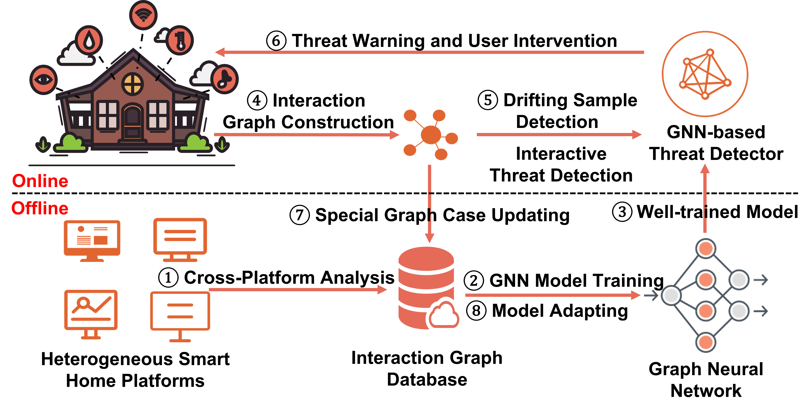

# Overview

Glint is a graph learning-based system for interactive threat detection in heterogeneous smart home rule data.

This work is published at **2023 ACM SIGMOD/PODS International Conference on Management of Data**. 

# Glint Architecture 

Glint comprises two components:

1- Interaction Graph Construction: extracts home automation rules from five platforms and consructs interaction graphs.

2- Graph Learning-based Model: designs ITGNN Graph representation learning model and corresponding deep learning techniques to enhance model performance.




# Interaction Graph Dataset

1. We use Scrapy to crawl publicly available rule descriptions from 5 smart home platforms: SmartThings, IFTTT, Amazon Alexa, Google Assistant, Home Automation.

| IFTTT   | SmartThings | Alexa Skill | Google Assistant | Home Assistant |
|---------|-------------|-------------|------------------|----------------|
| 316,928 | 185         | 5,506       | 5,292            | 574            |

2. We construct interaction graphs on signle platforms or cross-platforms, and compose homogeneous graph dataset and heterogeneous graph dataset. We use the Deep Graph Library (DGL) to build the graph datasets. The stored labeled graph dataset file for IFTTT is 21.8G, the one for SmartThings is 0.018G, and the heterogeneous graph amounts to 81.6G.


# ITGNN Graph Model

We design the unified ITGNN model for multi-scale graph representation learning.

To train the model:

1. Clone the repository.
1. Configure Anaconda environment according to the package-list.text file.
1. Run `./ITGNN/main.py`.

The arguments are described in greater detail in the source files.

# Citation
```
@article{wang2023graph,
  title={Graph Learning for Interactive Threat Detection in Heterogeneous Smart Home Rule Data},
  author={Wang, Guangjing and Ivanov Nikolay and Chen, Bocheng and Wang, Qi and Nguyen, Thanhvu and Yan, Qiben},
  journal={Proceedings of the ACM on Management of Data (PACMMOD)},
  volume={1},
  number={1},
  year={2023},
  publisher={ACM}
}
```